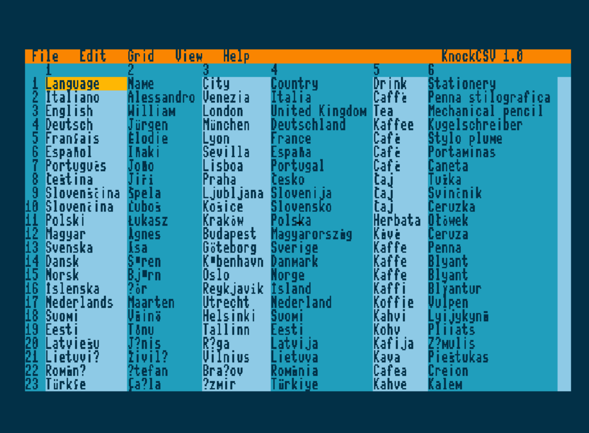

# KnockCSV

**KnockCSV** is a lightweight CSV viewer and editor designed for classic
and retro computer platforms.

The project aims to provide a spreadsheet-like environment for working
with CSV files on systems where modern spreadsheet applications are
unavailable or impractical.

## Screenshot



*KnockCSV 1.0 running on the MEGA65.*

## Supported platforms

  Platform       Status
  -------------- -------------------------------
  MEGA65         **Supported --- Version 1.0**
  Commodore 64   Planned
  Amiga          Planned

The first implementation of KnockCSV has been developed specifically for
the **MEGA65**. Future ports may have different interfaces, features and
limitations depending on the capabilities of each platform.

## KnockCSV for MEGA65

The MEGA65 version provides a spreadsheet-like interface with mouse and
keyboard support and takes advantage of MEGA65-specific hardware and
45GS02 features.

### Features

-   Open, edit and save CSV files
-   Save As
-   Automatic delimiter detection
-   PETSCII and UTF-8 decoding modes
-   Multiline cells
-   Full-screen editor for long cell contents
-   Insert and delete rows and columns
-   Copy, Cut and Paste
-   Multi-cell selection
-   Directional Fill and Fill All
-   Alphabetical, numeric and length-based sorting
-   Find and Replace
-   Replace All
-   Case-sensitive search
-   Horizontal and vertical scrolling
-   Horizontal and vertical split views
-   Configurable header rows and columns
-   80×25 and 80×50 display modes
-   Mouse support
-   Custom MEGA65 palette and character set

### Keyboard shortcuts

  Shortcut     Action
  ------------ ----------------------------------
  `MEGA + O`   Open
  `MEGA + S`   Save
  `MEGA + C`   Copy
  `MEGA + V`   Paste
  `MEGA + X`   Cut
  `MEGA + F`   Find
  `F3`         Find Next
  `DEL`        Delete
  `RETURN`     Edit / confirm cell contents
  `ESC`        Exit the full-screen text editor

Additional operations are available through the application menus.

## Building the MEGA65 version

KnockCSV for MEGA65 is written in **C and 45GS02 assembly** and built
using the **Calypsi C compiler**.

Run:

``` sh
make
```

This builds the three executables used by the MEGA65 version:

``` text
KnockCSV.prg
edit.prg
search.prg
```

The `SPLASH` file is also required at runtime and must be available
together with the executables.

To remove generated files:

``` sh
make clean
```

The Makefile only builds the executables. Creation of disk images and
transfer to a MEGA65 are intentionally left to the user.

## Source code

Version 1.0 contains the source code for the **MEGA65 implementation**
of KnockCSV.

The MEGA65 version uses a mixture of C and 45GS02 assembly. Assembly is
extensively used for the user interface, video, mouse, file handling and
CSV operations.

The application is divided into three executables to reduce conventional
memory usage:

-   **KnockCSV.prg** --- main application and CSV viewer
-   **edit.prg** --- editing operations
-   **search.prg** --- Find and Replace functions

The overlays are loaded when required and return control to the main
application.

## Future platforms

KnockCSV is intended to become a multi-platform retro-computing project.

Ports currently being considered include:

-   **Commodore 64**
-   **Amiga**

These will not necessarily be direct ports of the MEGA65 source code.
Each implementation may be adapted to the architecture, memory, display
and operating environment of its target machine while retaining the
general KnockCSV concept and workflow.

## Project philosophy

KnockCSV aims to make working with CSV data practical on classic
computers while respecting the characteristics and limitations of the
original hardware.

Rather than trying to reproduce a modern spreadsheet application, the
goal is to provide a fast and focused tool for viewing, navigating and
editing tabular text data.

## Version 1.0

**KnockCSV 1.0** is the first public release of the project and
introduces the **MEGA65** implementation.

Support for additional platforms is planned for future development.

## License

See the `LICENSE` file for licensing information.
